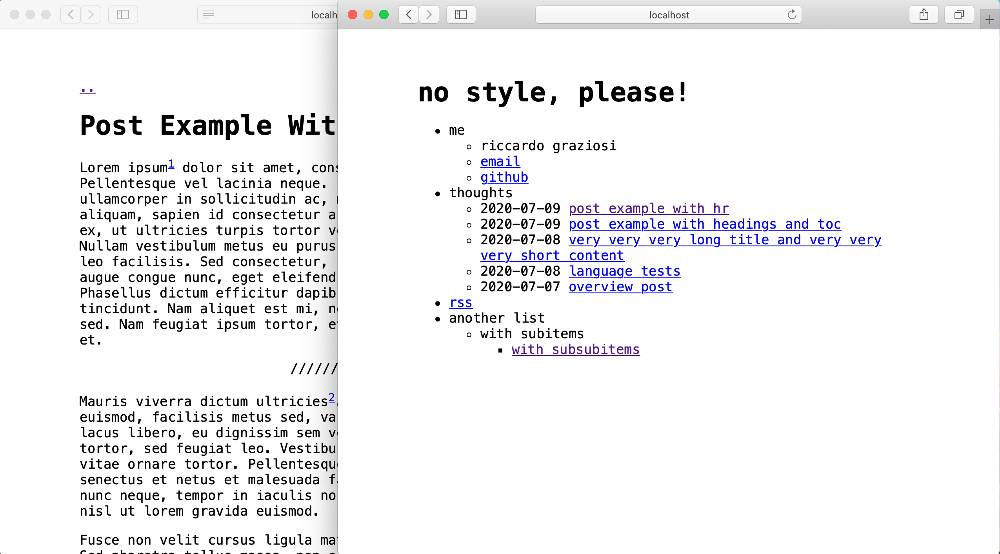

# no style, please!

 A (nearly) no-css minimalist [Jekyll](https://jekyllrb.com/) theme. Inspired by [elly's site](http://tilde.town/~elly/), expressly created for [my personal blog](https://riggraz.dev/).

[Try the demo out!](https://riggraz.dev/no-style-please/)



## Installation

If you haven't already created your blog using Jekyll, follow the [instructions](https://jekyllrb.com/docs/) to do so from Jekyll's documentation.

NOTE: if you are using Jekyll with GitHub Pages, see the [GitHub Pages installation section](#github-pages-installation).

Then, to style your blog with this theme, add this line to your Jekyll site's `Gemfile`:

```ruby
gem "no-style-please"
```

And add this line to your Jekyll site's `_config.yml`:

```yaml
theme: no-style-please
```

And then execute:

    $ bundle

Or install it yourself as:

    $ gem install no-style-please

### GitHub Pages installation

If you want to use this theme for your Jekyll's site deployed on [GitHub Pages](https://pages.github.com/), follow the instructions on [this page](https://docs.github.com/en/github/working-with-github-pages/adding-a-theme-to-your-github-pages-site-using-jekyll#adding-a-theme).

## Usage

You can edit `_config.yml` file to customize your blog. You can change things such as the name of the blog, the author, how dates are formatted, etc. Customizable fields should be straightforward to understand, however `_config.yml` contains some comments to help you understand what each fields does.

For further customization (e.g. layout, CSS) see the [official Jekyll's documentation](https://jekyllrb.com/docs/themes/#overriding-theme-defaults) on customizing gem-based themes.

### Customize the menu

In order to add/edit/delete entries from the main menu, you have to edit the `menu.yml` file inside `_data` folder. Through that file you can define the structure of the menu. Take a look at the default configuration to get an idea of how it works and read on for a more comprehensive explanation.

The `menu.yml` file accepts the following fields:

- `entries` define a new unordered list that will contain menu entries
- each entry is marked by a `-` at the beginning of the line
- each entry has the following attributes:
    - `title`, which defines the text to render for that menu entry
    - `url`, which can either be a URL or `false`. If it is `false`, the entry will be rendered as plain text; otherwise the entry will be rendered as a link pointing to the specified URL. Note that the URL can either be relative or absolute.
    - `post_list`, which can be `true` or `false`. If it is true, the entry will have all posts in the site as subentries. This is used to render your post list.
    - `entries`, yes, you can have entries inside entries. In this way you can create nested sublists!

## Contributing

Bug reports and pull requests are welcome on GitHub at https://github.com/[USERNAME]/hello. This project is intended to be a safe, welcoming space for collaboration, and contributors are expected to adhere to the [Contributor Covenant](http://contributor-covenant.org) code of conduct.

## Development

To set up your environment to develop this theme, run `bundle install`.

Your theme is setup just like a normal Jekyll site! To test your theme, run `bundle exec jekyll serve` and open your browser at `http://localhost:4000`. This starts a Jekyll server using your theme. Add pages, documents, data, etc. like normal to test your theme's contents. As you make modifications to your theme and to your content, your site will regenerate and you should see the changes in the browser after a refresh, just like normal.

When your theme is released, only the files in `_layouts`, `_includes`, `_sass` and `assets` tracked with Git will be bundled.
To add a custom directory to your theme-gem, please edit the regexp in `no-style-please.gemspec` accordingly.

## License

The theme is available as open source under the terms of the [MIT License](https://opensource.org/licenses/MIT).

